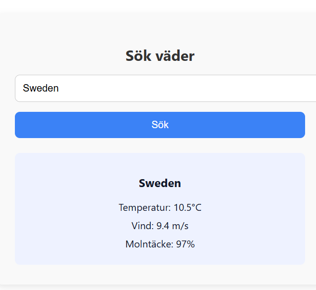
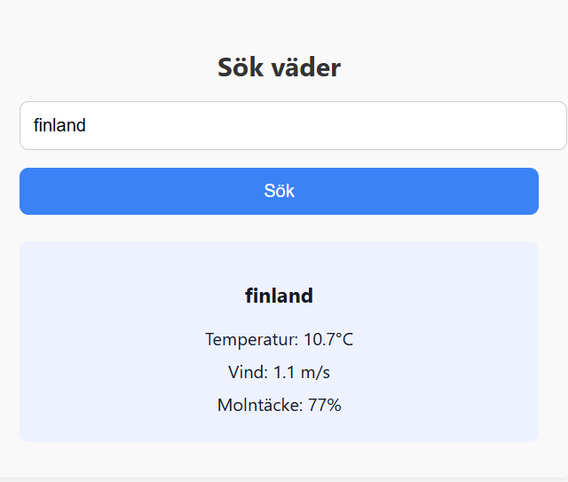
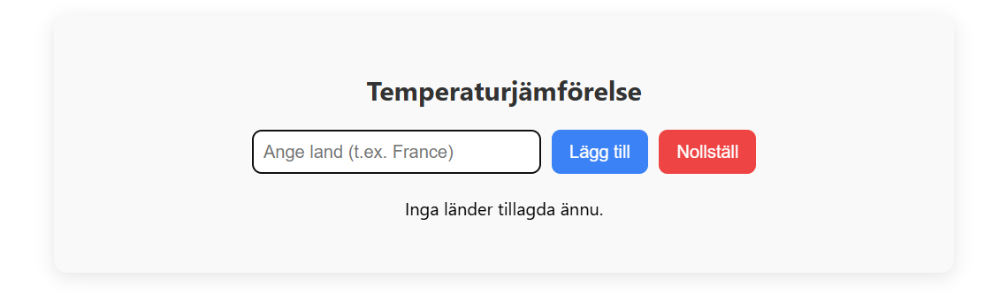
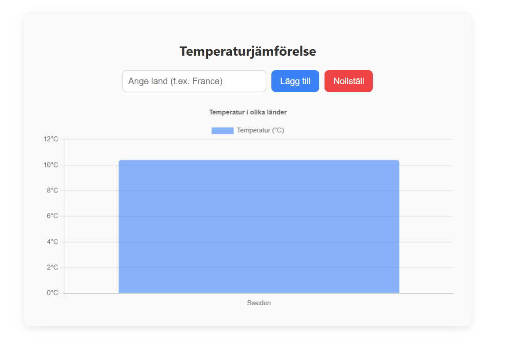
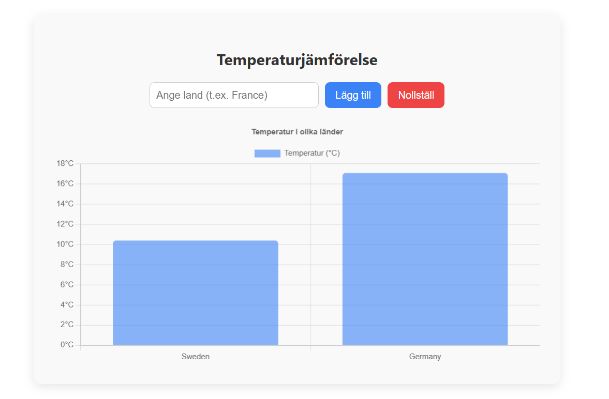
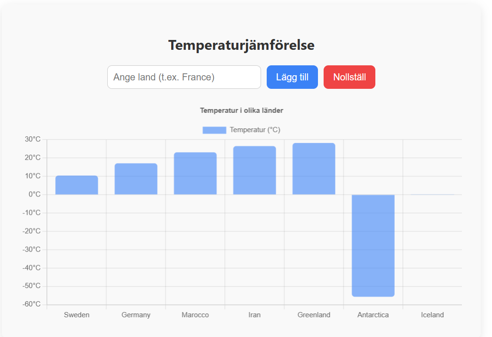

# Temperaturjämförelse i React med Axios och Chart.js

Detta projekt är en interaktiv React-applikation som demonstrerar hur man integrerar externa REST API:er med Axios och visualiserar data med Chart.js. Användaren kan söka efter länder, hämta aktuell temperatur via Open-Meteo API och jämföra värden i ett stapeldiagram. Applikationen är dynamisk, responsiv och helt byggd med öppen teknik utan behov av API-nyckel.

---

## Innehåll

1. [API-integration med Axios](#api-integration-med-axios)
2. [Visualisering och jämförelse](#visualisering-och-jämförelse)
3. [Använd teknik och projektstruktur](#använd-teknik-och-projektstruktur)
4. [React-baserad utvecklingsmiljö (CRA)](#react-baserad-utvecklingsmiljö-cra)
5. [Exempelbilder](#exempelbilder)
6. [Installationsguide](#installationsguide)
7. [Förslag på vidareutveckling](#förslag-på-vidareutveckling)
8. [Licens och kontakt](#licens-och-kontakt)

---

## API-integration med Axios

Projektet använder Axios för att hämta och hantera data från två öppna REST API:er från Open-Meteo:

- **Geocoding API** – omvandlar platsnamn till latitud/longitud:

https://geocoding-api.open-meteo.com/v1/search?name=Berlin


- **Forecast API** – hämtar aktuell temperatur baserat på koordinater:


https://api.open-meteo.com/v1/forecast?latitude=52.52&longitude=13.41&current=temperature_2m&timezone=auto


Tekniken bygger på `async/await` för asynkrona anrop och `try/catch` för felhantering. Axios används dynamiskt för att skapa URL:er baserat på användarinmatning.

---

## Visualisering och jämförelse

Applikationen gör det möjligt att:

- Söka efter ett valfritt land och hämta dess aktuella temperatur
- Visualisera temperaturer i ett stapeldiagram via Chart.js
- Dynamiskt lägga till flera länder och se dem uppdateras i grafen
- Rensa all data med en nollställningsknapp
- Förhindra dubletter baserat på landsnamn

Användaren interagerar genom ett enkelt formulär. När ett land läggs till hämtas först koordinater, sedan temperatur, som visualiseras i realtid. All logik hanteras med React-hooks (`useState`, `useEffect`) och all rendering sker dynamiskt.

---

## Använd teknik och projektstruktur

| Teknik            | Användning                                     |
|-------------------|------------------------------------------------|
| React             | UI, tillstånd och komponentstruktur            |
| Axios             | Anrop till externa API:er                      |
| Chart.js          | Stapeldiagram för visualisering                |
| react-chartjs-2   | React-integration för Chart.js                 |
| Open-Meteo API    | Geocoding + väderdata (gratis, ingen nyckel)  |
| CSS               | Layout och stil                                |
| Create React App  | Projektstruktur och utvecklingsmiljö           |


---

## React-baserad utvecklingsmiljö (CRA)

Projektet är uppsatt med [Create React App](https://create-react-app.dev) och stödjer följande kommandon:

- `npm start` – Startar utvecklingsservern på [http://localhost:3000](http://localhost:3000)
- `npm test` – Kör testsuiten i watch mode
- `npm run build` – Skapar en produktionsfärdig build i `build/`
- `npm run eject` – Exporterar all konfiguration från CRA (irreversibel)

---

## Exempelbilder

Diagrammet växer dynamiskt när länder läggs till. Nedan syns två exempel på resultat:















---

## Installationsguide

Följ dessa steg för att installera och köra projektet lokalt:

1. Klona projektet:
   ```bash
   git clone https://github.com/AryaEisa/integration_av_API_med_axios.git
   

- npm install


- npm start


## kontakt

-  Arya Eisa
-  E-post: aryapoureisa@gmail.com
-  Webbplats: https://aryaeisa.com